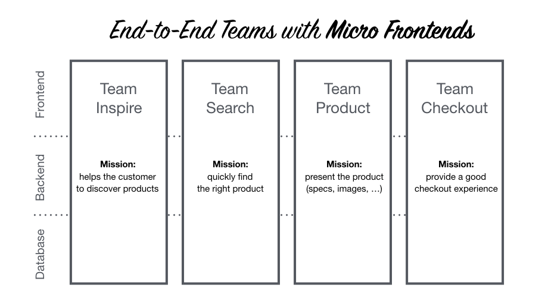

# GATEWAY 

This is Micro Frontends proof of concept. 

To cover these **requirements**: 
* separate frontend per every microservice (micro frontend AKA ‘MF’)
* MF independently deployable, has to be dynamically loaded in runtime (not statically built)
    * via canary deployment we want to load ALPHA microservice in version 1.0, but BETA microservice in version 1.2
    * other canary deployment wants to load ALPHA microservice in version 2.0, but BETA microservice in version 1.0
* frontend source codes as part of the backend git repository (to be versioned together)
* preserve look and feel of SPA application
    * like desktop application
    * instant switching between modules
    * only one full reload

### Architecture

### Implementation

Current implementation is based on [Angular](https://angular.io/) and [Angular Package Format](https://docs.google.com/document/d/1CZC2rcpxffTDfRDs6p1cfbmKNLA6x5O-NtkJglDaBVs/preview) (via library [ng-packagr](https://github.com/ng-packagr/ng-packagr)).

Micro frontends can be found here: 
* ALPHA [github.com/marfusios/micro-frontend-alpha](https://github.com/Marfusios/micro-frontend-alpha)
* BETA [github.com/marfusios/micro-frontend-beta](https://github.com/Marfusios/micro-frontend-beta)

Gateway deployed at: [mkotas.cz/micro-frontend-gateway](http://mkotas.cz/micro-frontend-gateway)

### Usage

* local development
    * `npm start`
    * modify urls in 'app-routing.module.ts'
* remote deployment
    * `npm build-deploy`
    * copy content of 'deployment' directory into web server

### Resources

* [Micro Frontends idea](https://micro-frontends.org/)
* [Lazy Loading Angular modules from a remote server](https://www.all-loops-considered.org/2018/07/07/angular-remote-lazy-loading/)
* [Creating a Library with Angular CLI](https://blog.angularindepth.com/creating-a-library-in-angular-6-87799552e7e5)
